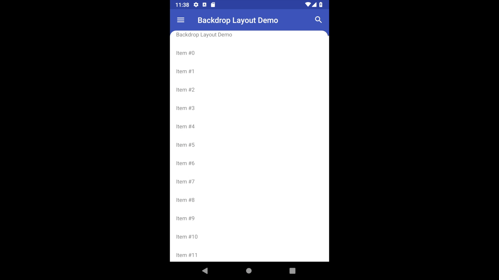

# Backdrop

[  ](https://bintray.com/rokarpov/Backdrop/backdrop/_latestVersion)

This library provides layouts and the CoordinatorLayout's behaviors that allow you to use the [Backdrop](https://material.io/design/components/backdrop.html) component in your app:



Add the following line into the app's gradle config to import the library:

```gradle
implementation 'io.github.rokarpov:backdrop:0.3'
```

After that you can insert the ```BackLayer``` and ```FrontLayer``` (optional) that implement the Backdrop component into your layout. 
Note that all unimportant attributes are skipped.

```xml
<androidx.coordinatorlayout.widget.CoordinatorLayout>
    <io.github.rokarpov.backdrop.BackdropBackLayer
        android:id="@+id/main__back_layer">
        <androidx.appcompat.widget.Toolbar
            android:id="@+id/main__toolbar"
            app:layout_childType="header"/>
        <com.google.android.material.navigation.NavigationView
            android:id="@+id/main__navigation_view"
            app:layout_childType="content"
            app:layout_hideHeaderOnReveal="false"
            app:layout_minRevealedFrontViewHeight="@dimen/subheader_height"/>
        <io.github.rokarpov.backdrop.demo.SearchBackView
            android:id="@+id/main__search_view"
            app:layout_childType="content"
            app:layout_hideHeaderOnReveal="true"
            app:layout_minRevealedFrontViewHeight="@dimen/subheader_height"/>
    </io.github.rokarpov.backdrop.BackdropBackLayer>

    <io.github.rokarpov.backdrop.BackdropFrontLayer
        android:id="@+id/main__front_layer">
        <TextView
            app:layout_childType="header"/>
        <androidx.recyclerview.widget.RecyclerView
            app:layout_childType="content"/>
    </io.github.rokarpov.backdrop.BackdropFrontLayer>
</androidx.coordinatorlayout.widget.CoordinatorLayout>
```

The markup above uses the following attributes:

|Attribute                              |Description                                                                        |
|---------------------------------------|-----------------------------------------------------------------------------------|
|```layout_childType``` (BackLayer's)   |Specifies whether the view is a header or a revealing content.                     |
|```layout_hideHeaderOnReveal```        |Specifies whether the header should be hidden, when the view is revealed.          |
|```layout_minRevealedFrontViewHeight```|Specifies the size of the front layer's on-screen part when the view is revealed.  |
|```layout_childType``` (FrontLayer's)  |Specifies whether the view is a front layer's subheader and should not be scrimmed.|

The Backdrop component layout configuration is done. 
Now you can customize how it behaves using the ```BackdropController``` class and its builder:

```kotlin
val backLayer = findViewById<BackdropBackLayer>(R.id.rootLayout)
backdropController = BackdropController.build(backLayer, applicationContext) {
    supportToolbar = toolbar
    navigationIconSettings(navigationView) {
        titleId = R.string.main__navigation_title
    }
    menuItemRevealSettings(R.id.menu_main__search, searchView)
    interactionSettings(searchView) {
        // The builder allows you to configure the header's visibility on reveal too.
        hideHeader = true
        animationProvider = SearchBackView.AnimatorProvider
    }
    concealedTitleId = R.string.app_name
    concealedNavigationIconId = R.drawable.ic_hamburger
    revealedNavigationIconId = R.drawable.ic_close
}
```

After that you should not reveal or conceal the back layer's content views. 
All this work the controller will do, but it provides the ```reveal``` and ```conceal``` methods that allow you to change the component state manually.